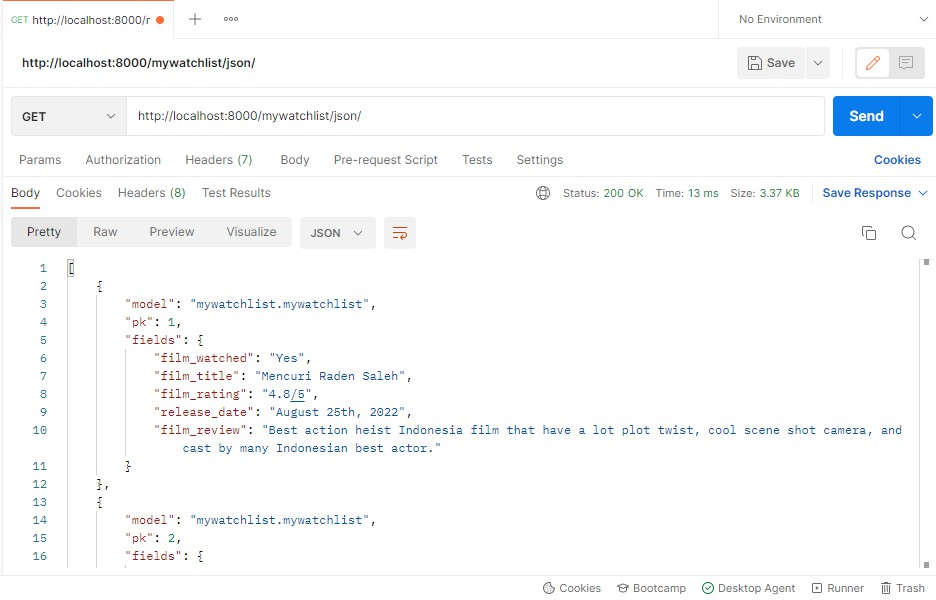
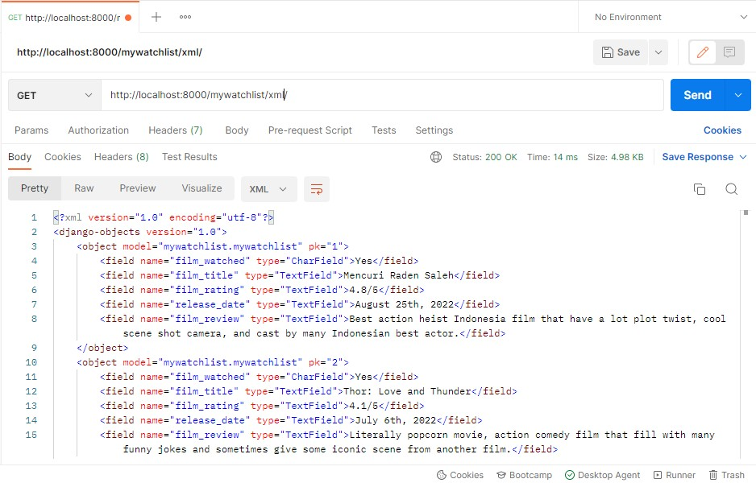
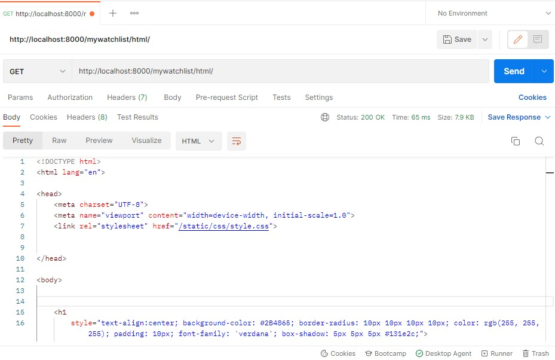

# Tugas 3: Pengimplementasian Data Delivery Menggunakan Django

Pemrograman Berbasis Platform (CSGE602022) - diselenggarakan oleh Fakultas Ilmu Komputer Universitas Indonesia, Semester Ganjil 2022/2023 

#

### Link Heroku
- pbp-tugas2-papian.herokuapp.com/mywatchlist/html
- pbp-tugas2-papian.herokuapp.com/mywatchlist/json
- pbp-tugas2-papian.herokuapp.com/mywatchlist/xml

#

### Jelaskan perbedaan antara JSON, XML, dan HTML!
Jawab :

- JSON (JavaScript Object Notation) merupakan format dalam bentuk notasi objek JavaScript untuk merepresentasikan data dengan bentuk yang efisien yang terdiri dari key dan value. JSON ini sebenarnya kurang rapih jika dilihat secara visual namun lebih cepat pengaksesannya dan lebih mudah dibaca mesin. 

- XML (Extensive Markup Language) merupakan markup language  yang merepresentasikan data  dalam bentuk element tree, mirip seperti HTML karena menggunakan tags, tetapi tidak rujukan untuk ditampilankan pada web browser.

- HTML (Hypertext Markup Language) merupakan markup language yang merepresentasikan data dalam element tree yang dirujukan untuk ditampilkan dalam bentuk web dan dapat di-kostumisasi cara penyajiannya, serta lebih mudah dibaca karena menggunakan tags

### Jelaskan mengapa kita memerlukan data delivery dalam pengimplementasian sebuah platform?
Jawab :

Data delivery sangat sering terjadi dalam pengimplementasi sebuah platform. Hal tersebut menandakan terjadinya pertukaran data user dengan data yang ada di server. Data delivery juga berguna untuk membantu mempermudah melakukan proses pengiriman data. Dalam penggunaannya, data delivery menggunakan format HTML, JSON, dan XML supaya data yang dikirim mudah dipahami berbagai programming language untuk didevelop serta dapat diterima dengan baik dan dipahami oleh user.

### Jelaskan bagaimana cara kamu mengimplementasikan checklist di atas
Jawab :
- Membuat aplikasi 'mywatchlist' pada repository assignment sebelumnya dengan menjalankan command 'python manage.py startapp mywatchlist' di folder main pada cmd.
- Melakukan routing url dengan menambahkan 'path('mywatchlist/', include('mywatchlist.urls'))' untuk connecting urlpatterns pada 'mywatchlist/urls.py' dengan url patterns pada 'project_django/urls.py'. Lalu, menambahkan 'mywatchlist' pada 'installed app' yang ada di setting.py. Selain itu juga menambahkan pattern path yang diperlukan seperti 'path('html/', show_mywatchlist, name='show_mywatchlist')' dan lain lain.
- Menambahkan model baru bernama 'MyWatchList' pada 'mywatchlist/models.py' dengan atribut 'film_watched', 'film_title', 'film_rating', 'release_date', dan 'film_review'. Selanjutnya melakukan migrasi dengan menggunakan command 'python manage.py makemigrations' dan  'python manage.py migrate'
- Membuat folder 'fixtures' yang didalamnya terdapat sebuah berkas 'initial_mywatchlist_data.json' yang berisi 10 data yang ditambahkan untuk objek 'MyWatchList' serta melakukan loaddata dengan perintah command 'python manage.py loaddata initial_mywatchlist_data.json
- Membuat beberapa fungsi dengan parameter request pada views.py untuk menyajikan data dalam bentuk HTML, XML, dan JSON serta melakukan routing dengan menambahkan path url pada 'urls.py'.
- Terakhir, melakukan git add, commit dan push ke repository github yang telah terkoneksi dengan aplikasi heroku agar otomatis ke deploy.

#

## POSTMAN

### JSON

### XML

### HTML

